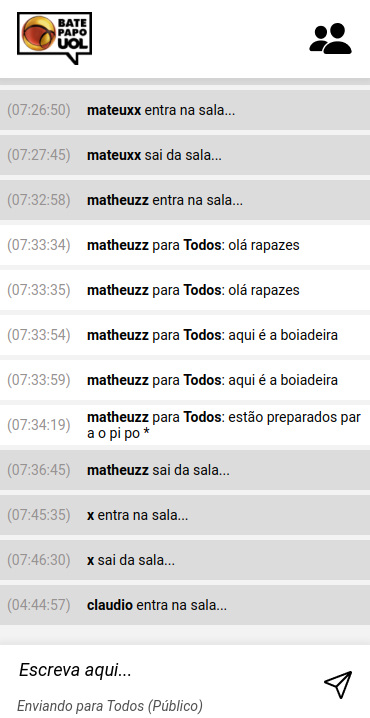

  <h1>BATE PAPO UOL</h1>

 
  
- Criação do front-end de um aplicativo web para sala de bate papo online
   
- Tela exclusiva para mobile
   
- Conexão com a API utilizando axios para alimentação dos dados das mensages, participantes online e mensagens privadas

# Funcionalidades
- Entre com um nome, não é necessáario login
- Opção de enviar uma mensagem privada para algum participante ou mensagem pública para todos
- Com a saída da sala, será desconectado automaticamente 
- Lista de participantes online atualizada 
- Scroll automático para a última mensagem da sala

# Tecnologias 
- 
- 
- 
- 
- 
- 
- 

# Preview

  
   
   
  
Clique na imagem para acessar a página

 